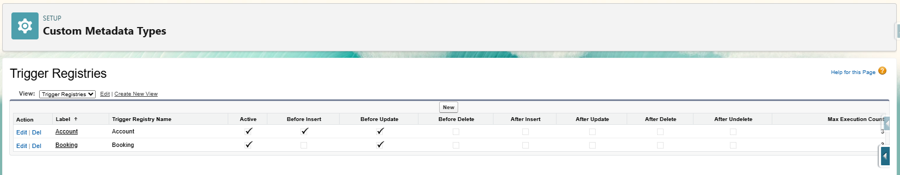
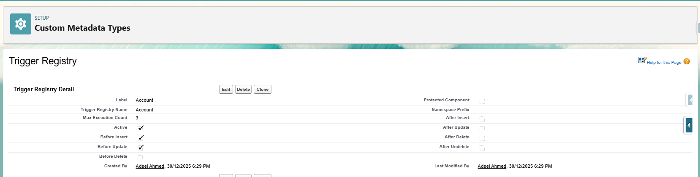
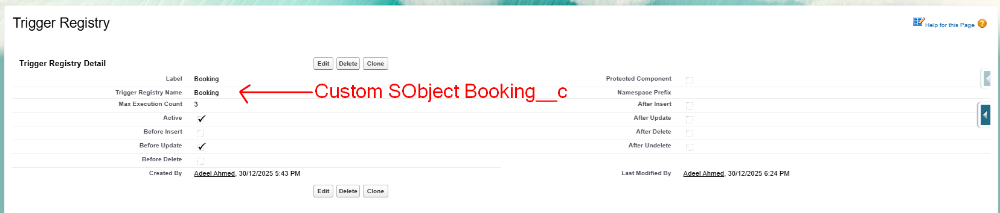

# Apex Trigger Handler Framework with Custom Metadata-Controlled Triggers

   

A modern Salesforce Apex Trigger Handler framework with trigger behavior fully controllable through a Custom Metadata Type registry. It enables clean, scalable, and maintainable trigger automation while giving administrators and developers fine-grained control over execution.

Robust, testable trigger handling framework for Salesforce. It follows one-trigger-per-object and centralizes trigger orchestration in an abstract base handler class (`TriggerBase`). Activation and per-operation enablement (before/after insert/update/delete/undelete) are controlled via a Custom Metadata Type (`Trigger_Registry__mdt`).

## Deployment

| Environment           | Installation Link                                                                                                                                         | Version   |
| --------------------- | --------------------------------------------------------------------------------------------------------------------------------------------------------- | --------- |
| Production, Developer | [](https://login.salesforce.com/packaging/installPackage.apexp?p0=04tIU000000r93xYAA) | ver 2.0 |
| Sandbox               | [](https://test.salesforce.com/packaging/installPackage.apexp?p0=04tIU000000r93xYAA) | ver 2.0 |

**Note: While installing the package, make sure to open "Advanced Options" and select "Compile only the Apex in the package."**

## Post-deployment:
- Create `Trigger_Registry__mdt` records per Salesforce Object (`SObject`) to control activation
- Examples:





## Enabling/Disabling Triggers and Operations

Use the Trigger Registry Custom Metadata Type (`Trigger_Registry__mdt`) to switch on/off either the entire trigger for an SObject or specific operations, providing maximum flexibility across environments.

What you can control (Label (API Name)):
- Global activation — `Active` (Active__c)
- Per-operation activation:
  - `Before Insert` (Before_Insert__c)
  - `Before Update` (Before_Update__c)
  - `Before Delete` (Before_Delete__c)
  - `After Insert` (After_Insert__c)
  - `After Update` (After_Update__c)
  - `After Delete` (After_Delete__c)
  - `After Undelete` (After_Undelete__c)
- Depth guard — `Max Execution Count` (Max_Execution_Count__c)

### Quick reference:
- Disable all logic for an SObject: set `Active` (Active__c) = false
- Enable only specific operations: set `Active` (Active__c) = true and turn on only the desired flags (e.g., `Before Insert` (Before_Insert__c) = true; others = false)
- If the `Trigger_Registry__mdt` record or a specific flag is missing, that operation will not run

### Examples:
#### 1) Disable the whole trigger for Account
- Record: `Trigger Registry Name` (DeveloperName) = Account
- `Active` (Active__c) = false
- Other flags are ignored
- Case sensitivity and naming rules:
  - Always match the Standard SObject API Name exactly in case (e.g., `Account`, not `account`).
  - If case does not match or the Developer Name does not map (e.g., using `Account` as Developer Name), the framework will not find the configuration and operations will not run.

#### 2) Enable only Before Insert and After Update for Account
- `Active` (Active__c) = true
- `Before Insert` (Before_Insert__c) = true
- `After Update` (After_Update__c) = true
- All other operation flags = false

#### 3) Custom Object example (Booking__c)
**IMPORTANT**: Use the exact SObject API Name with correct case for the "Object Name" reference in your org, but when creating the Custom Metadata record, set the `Trigger Registry Name` (DeveloperName) to Booking (without `__c`) because Developer Name cannot include "`__`".
- Record: `Trigger Registry Name` (DeveloperName) = Booking
- This record controls the handler for the SObject API Name `Booking__c`
- Typical configuration to enable only After Insert:
  - `Active` (Active__c) = true
  - `After Insert` (After_Insert__c) = true
  - All other operation flags = false

### Case sensitivity and naming rules:
- Always match the Custom SObject API Name exactly in case (e.g., `Booking__c`, not `booking__c`).
- Custom Metadata Type `Trigger Registry Name` (DeveloperName) must NOT include "__c". For `Booking__c`, use `Booking`.
- If case does not match or the Developer Name does not map (e.g., using `Booking__c` as Developer Name), the framework will not find the configuration and operations will not run.

### Programmatic, context-based skip:
- For targeted scenarios (e.g., batch or data-migration transactions), skip execution without changing metadata:
  - Example: `TriggerBase.skippedTriggers.add(Account.SObjectType);`
- Use this sparingly; prefer metadata flags for normal release management

### Recommended practice:
- Use `Active` (Active__c) and the operation flags for environment-level control
- Use programmatic skip only for temporary, contextual needs in code

## Goals

- Decouple trigger plumbing from business logic
- Enable per-object/per-operation configuration via Custom Metadata Type
- Enforce bulkification and recursion/depth control
- Provide clean error surfacing to records
- Keep tests deterministic and maintainable

## Architecture

- One trigger per object
- Trigger delegates to a dedicated Handler: `TriggerBase.run(AccountTriggerHandler.class);`
- Handler inherits `TriggerBase` and overrides only the needed methods:
  - `beforeInsert`, `beforeUpdate`, `beforeDelete`
  - `afterInsert`, `afterUpdate`, `afterDelete`, `afterUndelete`
- Handler activity and operation flags come from Custom Metadata Type (`Trigger_Registry__mdt`)
- `ExecutionCount` prevents runaway recursion (configurable via Custom Metadata Type)
- Errors are added back to records with descriptive messages

### How It Works at Runtime

1. A DML operation fires a trigger.
2. The trigger calls `TriggerBase.run` with the handler `Type`.
3. `TriggerBase` constructs the handler, loads Custom Metadata Type config, and validates SObject type.
4. `TriggerBase` executes only the allowed lifecycle methods based on config and the current operation.
5. Any handled exceptions are surfaced into record errors via `addError`.

## Custom Metadata: Trigger Registry (Trigger_Registry__mdt)

- Object label: Trigger Registry
- Visibility: Public
- One record per Salesforce Object (`SObject`), using `DeveloperName` = SObject API Name (e.g., `Account`, `CustomObject__c`, etc.)

Recommended fields (Label (API Name)):
- `Active` (Active__c) — Checkbox, default true
- `Before Insert` (Before_Insert__c) — Checkbox
- `Before Update` (Before_Update__c) — Checkbox
- `Before Delete` (Before_Delete__c) — Checkbox
- `After Insert` (After_Insert__c) — Checkbox
- `After Update` (After_Update__c) — Checkbox
- `After Delete` (After_Delete__c) — Checkbox
- `After Undelete` (After_Undelete__c) — Checkbox
- `Max Execution Count` (Max_Execution_Count__c) — Number, execution depth guard (e.g., 5)

Behavior:
- When a registry record exists for a given Salesforce Object (SObject), its flags control which lifecycle callbacks execute for that SObject’s handler. If a flag or the record is missing, the respective operation will not run (the handler’s `isXyz` checks remain false).

## Usage Example (Account)

Trigger (example):
```
trigger AccountTrigger on Account(
  before insert,
  before update,
  before delete,
  after insert,
  after update,
  after delete,
  after undelete
) {
  TriggerBase.run(AccountTriggerHandler.class);
}
```

Handler (example):
```
public with sharing class AccountTriggerHandler extends TriggerBase {
    public AccountTriggerHandler() {
        super(Account.SObjectType);
    }

    protected override void beforeInsert() {
        if (!isBeforeInsert) return;
        // bulkified logic here, operate on (List<Account>) newList
        for (Account acc : (List<Account>) this.newList) {
          acc.Name = acc.Name + ' (New)';
        }
    }

    // override other lifecycle methods as needed (beforeUpdate, afterUpdate, etc.)
}
```

Registry Custom Metadata Type record:
- `Developer Name` (DeveloperName) = Account
- `Active` (Active__c) = true
- Set desired operation flags, for example:
  - `Before Insert` (Before_Insert__c) = true
  - `After Update` (After_Update__c) = true
- `Max Execution Count` (Max_Execution_Count__c) = 5

## Error Handling

- `processError(Exception ex)` — adds `ex.getMessage()` to each record via `addError`
- `processError(DmlException ex)` — uses the first DML error message when available
- `processError(DepthLimitException ex)` — uses the configured depth message
- Use these methods from custom logic to consistently surface errors

## Depth and Recursion Control

- `ExecutionCount` tracks how many times a handler executes per transaction per SObjectType
- If count exceeds `Max_Execution_Count__c`, a `DepthLimitException` is raised and surfaced via `addError`
- `TriggerBase.skippedTriggers` lets you programmatically skip execution for SObjectTypes (e.g., special batch contexts)

## Best Practices

- One trigger per object
- No SOQL/DML in loops; bulkify all logic
- Use `Database` methods with proper exception handling, prefer user mode as appropriate
- Respect FLS/sharing rules (use `with sharing`, `inherited sharing` or `without sharing` appropriately)
- Avoid recursion with `ExecutionCount` and early returns
- Keep handlers thin; move business logic to services for testability

## Contributing

- Fork, create a feature branch, commit with conventional messages, open a PR
- Include unit tests with meaningful assertions

## License

MIT (see LICENSE)
